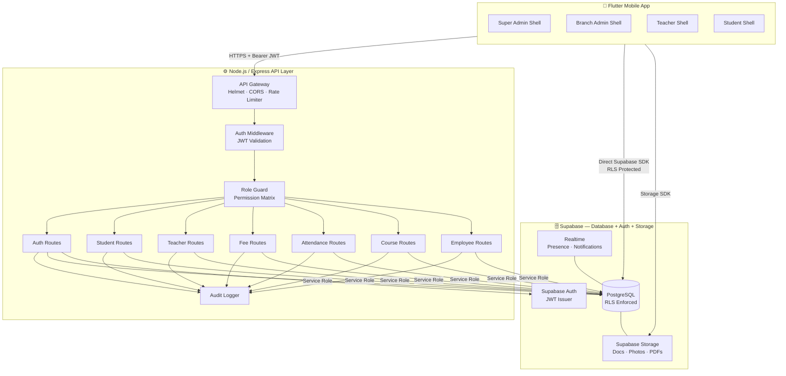
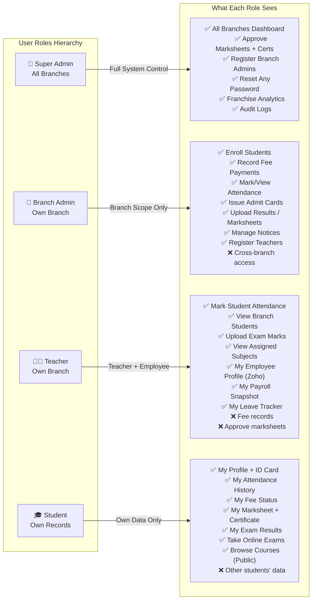
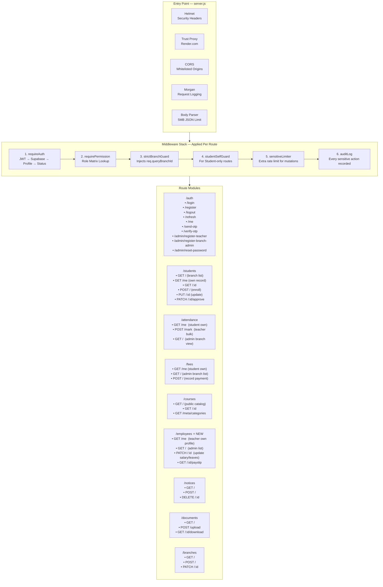
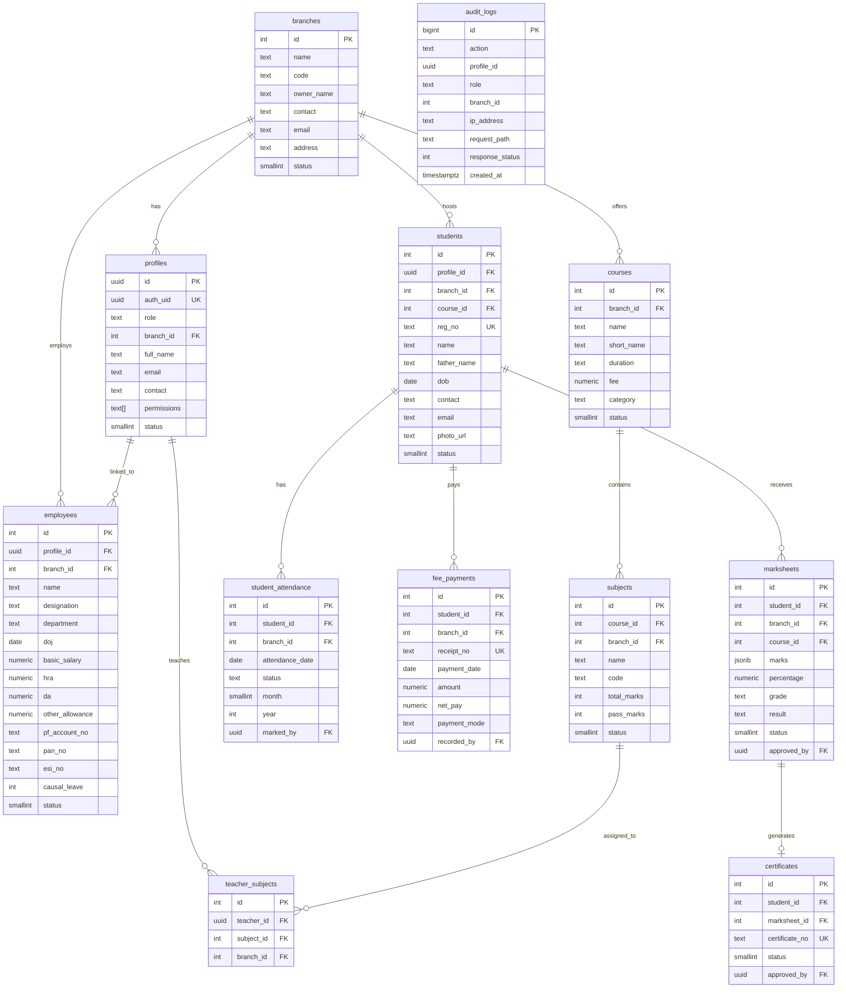
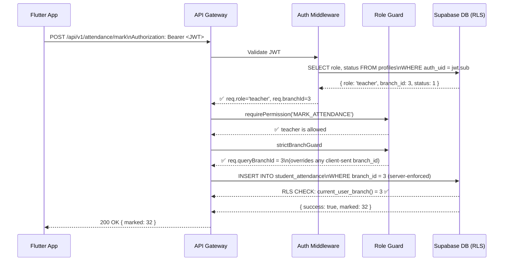
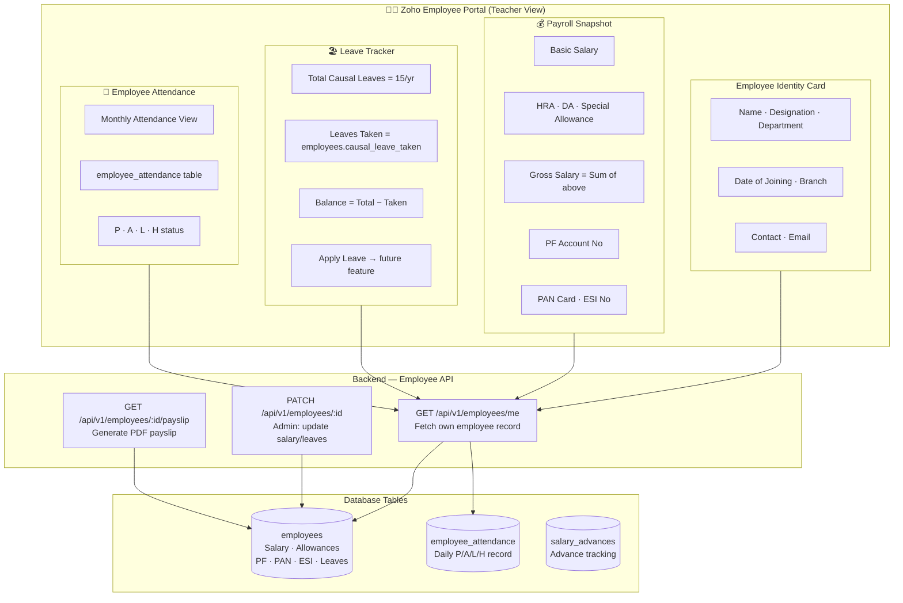
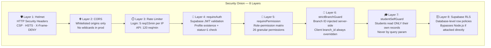
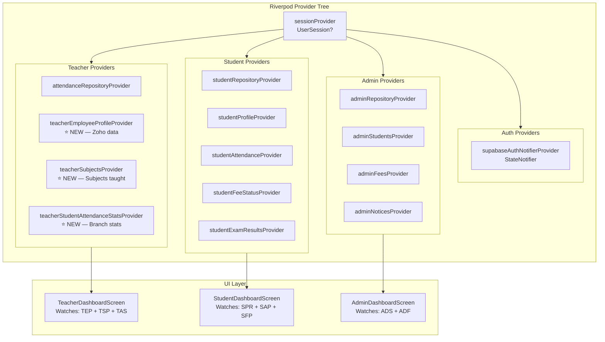
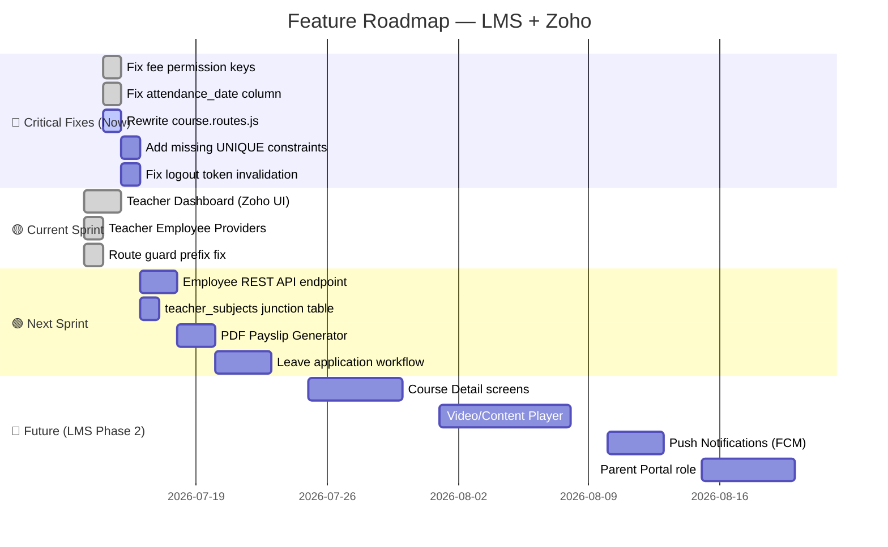

# 🏗️ Gokul Shree LMS — Full-Stack Architecture Design
### ClassPlus-Style LMS + Zoho-Style Employee Portal

---

## 1. System Overview

---

## 2. Multi-Role Access Architecture

---

## 3. Flutter Frontend — Module Architecture

```mermaid
graph TB
    subgraph APP["lib/src/"]
        direction TB

        subgraph CORE["core/"]
            THEME[theme/\nColors · Typography · AppTheme]
            MODELS[models/\nUserSession · AppUser]
            PROVIDERS[providers/\nsessionProvider · authNotifier]
            SERVICES[services/\nsupabaseService]
            ROUTING[routing/\napp_router.dart\nGoRouter + Role Guard]
        end

        subgraph FEATURES["features/"]
            direction LR

            subgraph AUTH_F["auth/"]
                A1[LoginScreen]
                A2[AccountScreen]
                A3[ForgotPasswordScreen]
                A4[supabaseAuthNotifier]
            end

            subgraph STUDENT_F["student/"]
                S1[StudentDashboard]
                S2[StudentAttendance]
                S3[StudentFeeStatus]
                S4[StudentIdCard]
                S5[StudentExams]
                S6[StudentMarksheet]
                SD[studentRepository\nstudentProviders]
            end

            subgraph TEACHER_F["teacher/"]
                T1[TeacherDashboard\n• Attendance Stats\n• Subjects I Teach]
                T2[TeacherAttendance\n• Mark Bulk Attendance]
                T3[TeacherStudents\n• Branch Student List]
                T4[TeacherResults\n• Upload Marks]
                T5[Zoho Employee Profile\n• Payroll · Leaves · Details]
                TD[attendanceRepository\nteacherProviders]
            end

            subgraph ADMIN_F["admin/"]
                AD1[AdminDashboard]
                AD2[AddStudent]
                AD3[FeeManagement]
                AD4[MarksheetGenerator]
                AD5[ExamScheduler]
                AD6[BranchRegistration]
                ADD[adminRepository]
            end

            subgraph HOME_F["home/"]
                H1[HomeScreen\nRole-aware Landing]
                H2[MenuScreen]
                H3[ContactScreen]
            end

            subgraph COURSES_F["courses/"]
                C1[CoursesScreen\nPublic Catalog]
            end

            subgraph DOCS_F["documents/"]
                D1[DocumentsScreen]
                D2[CertificatesScreen]
            end
        end
    end

    ROUTING -->|Guards + Redirects| AUTH_F & STUDENT_F & TEACHER_F & ADMIN_F
    PROVIDERS --> AUTH_F & STUDENT_F & TEACHER_F & ADMIN_F
    SERVICES --> SD & TD & ADD
```

---

## 4. Backend API Layer Architecture

---

## 5. Database Schema — Entity Relationship

---

## 6. Role-Based Data Flow

---

## 7. Zoho Employee Feature — Data Architecture

---

## 8. Security Architecture — Defence Layers

---

## 9. Flutter State Management Architecture (Riverpod)

---

## 10. What Needs to Be Built — Priority Roadmap

---

## Key Architecture Decisions

| Decision | Chosen | Reason |
|----------|--------|--------|
| Auth Provider | Supabase Auth | Built-in JWT, OTP, OAuth, admin APIs |
| Database | PostgreSQL via Supabase | RLS + real-time + REST auto-generation |
| API Layer | Node.js + Express | Fine-grained middleware control for audit logging |
| State Management | Riverpod (Flutter) | Compile-safe, testable, no BuildContext dependency |
| Navigation | GoRouter | Deep linking, shell routes, role-based redirect |
| Employee Data | `employees` table | Mirrors Zoho HR structure (salary, PF, ESI, leaves) |
| Branch Isolation | `strictBranchGuard` middleware | Server enforces branch_id — client cannot forge it |
| Permission Model | Flat permission strings in DB array | Per-user granular permissions, not just role-based |
| Storage | Supabase Storage | Photos, PDFs, marksheets, certificates all in one |
| Offline Support | Hive local cache (future) | Student ID card must work offline |
